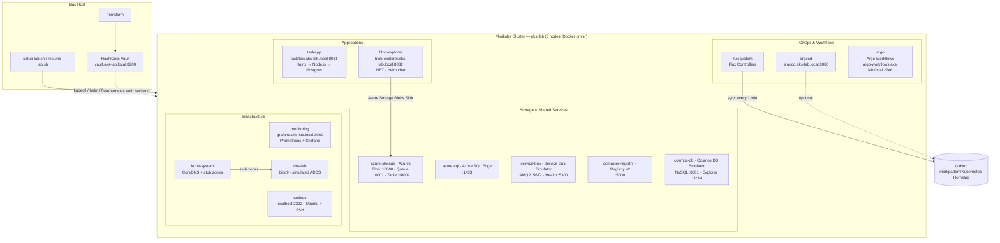

# AKS Lab — Architecture

| Service | URL | Port |
| --- | --- | --- |
| TaskFlow | <http://taskflow.aks-lab.local:8081> | 8081 |
| Grafana | <http://grafana.aks-lab.local:3000> | 3000 |
| ArgoCD | <https://argocd.aks-lab.local:8080> | 8080 |
| Blob Explorer | <http://blob-explorer.aks-lab.local:8082> | 8082 |
| HashiCorp Vault | <http://vault.aks-lab.local:8200/ui> | 8200 |
| Argo Workflows | <http://argo-workflows.aks-lab.local:2746> | 2746 |
| Service Bus (AMQP) | `localhost:5672` | 5672 |
| Container Registry | `localhost:5000` | 5000 |
| Cosmos DB (NoSQL) | `http://localhost:8081` · Explorer: `http://localhost:1234` | 8081 / 1234 |
| Azure SQL | `localhost:1433` | 1433 |
| Toolbox SSH | `ssh aks-toolbox` | 2222 |
