# AKS Lab — Architecture

```mermaid
graph TB
    subgraph multipass["Multipass VMs (ARM64 Ubuntu)"]
        sambad["samba-ad\nActive Directory DC\nLDAP :389 · Kerberos :88\ncorp.internal"]
        client["corp-client\nDomain-joined laptop\nrealmd + SSSD"]
    end

    subgraph host["Mac Host"]
        setup["./aks-lab (setup / resume)"]
        tf["Terraform"] --> vault["HashiCorp Vault\nvault.aks-lab.local:8200"]
        tf --> sambad
        tf --> client
    end

    gh[("GitHub\nmarkpadam/Kubernetes-Homelab")]

    subgraph cluster["Minikube Cluster — aks-lab  (Docker driver)"]
        subgraph auth["Identity & Auth"]
            ingress["ingress-nginx\nlocalhost:9980 → all web apps"]
            dex["dex\nOIDC provider\ndex.aks-lab.local:9980"]
            proxy["oauth2-proxy\nForward auth gateway\noauth2-proxy.aks-lab.local:9980/oauth2"]
        end
        subgraph gitops["GitOps & Workflows"]
            flux["flux-system\nFlux Controllers"]
            argo["argocd\nargocd.aks-lab.local:9980"]
            argowf["argo\nArgo Workflows :2746"]
        end
        subgraph apps["Applications"]
            taskapp["taskapp\ntaskflow.aks-lab.local:9980\nNginx → Node.js → Postgres"]
            blobapp["blob-explorer\nblob-explorer.aks-lab.local:9980\n.NET · Helm chart"]
        end
        subgraph store["Storage & Shared Services"]
            azurite["azure-storage · Azurite\nBlob :10000 · Queue :10001 · Table :10002"]
            sql["azure-sql · Azure SQL Edge\n:1433"]
            rabbit["service-bus · Service Bus Emulator\nAMQP :5672 · Health :5300"]
            reg["container-registry · Registry v2\n:5000"]
            mongo["cosmos-db · Cosmos DB Emulator\nNoSQL :8081 · Explorer :1234"]
        end
        subgraph infra["Infrastructure"]
            mon["monitoring\ngrafana.aks-lab.local:9980\nPrometheus + Grafana"]
            box["toolbox\nlocalhost:2222 · Ubuntu + SSH"]
            dns["dns-lab\nbind9 · privatelink zones"]
            coredns["kube-system\nCoreDNS · corp.internal → samba-ad"]
        end
    end

    setup -->|"kubectl / helm / flux"| cluster
    vault -.->|"Kubernetes auth backend"| cluster
    flux -->|"sync every 1 min"| gh
    argo -.->|"optional"| gh
    blobapp -->|"Azure.Storage.Blobs SDK"| azurite
    coredns -->|"privatelink stub zones"| dns
    coredns -->|"corp.internal forward"| sambad
    client -->|"realm join"| sambad
    ingress -->|"auth sub-request"| proxy
    proxy -->|"OIDC"| dex
    dex -->|"LDAP :389"| sambad
    ingress --> taskapp
    ingress --> blobapp
    ingress --> mon
    ingress --> argo
```



## SSO Authentication Flow

```text
User → NGINX Ingress → OAuth2 Proxy (/oauth2/auth)
                            │
                      No session? → redirect to Dex (/auth)
                            │
                          Dex → LDAP bind → SambaAD → AD account
                            │
                     Issue JWT (ID token)
                            │
                      OAuth2 Proxy → set session cookie
                            │
                       NGINX → forward request + inject headers
                            │
                      Backend (receives X-Auth-Request-User, X-Auth-Request-Email)
```

## Service URLs

All web apps are accessed through the NGINX ingress controller port-forward on **port 9980**.

| Service | URL | Notes |
| --- | --- | --- |
| TaskFlow | <http://taskflow.aks-lab.local:9980> | OAuth2 SSO protected |
| Grafana | <http://grafana.aks-lab.local:9980> | OAuth2 SSO protected |
| ArgoCD | <http://argocd.aks-lab.local:9980> | OAuth2 SSO + ArgoCD auth |
| Blob Explorer | <http://blob-explorer.aks-lab.local:9980> | OAuth2 SSO protected |
| Dex (OIDC) | <http://dex.aks-lab.local:9980> | OIDC discovery endpoint |
| OAuth2 Proxy | <http://oauth2-proxy.aks-lab.local:9980/oauth2> | Auth gateway |
| HashiCorp Vault | <http://vault.aks-lab.local:8200/ui> | Token: root |
| Argo Workflows | `localhost:2746` | Direct port-forward |
| Service Bus (AMQP) | `localhost:5672` | Direct port-forward |
| Container Registry | `localhost:5000` | Direct port-forward |
| Cosmos DB (NoSQL) | `localhost:8081` · Explorer: `localhost:1234` | Direct port-forward |
| Azure SQL | `localhost:1433` | Direct port-forward |
| Toolbox SSH | `ssh aks-toolbox` | Port-forward :2222 |

## AD Test Accounts

| Username | Password | Domain |
| --- | --- | --- |
| `testuser1` | `AksLab!User1` | `corp.internal` |
| `testuser2` | `AksLab!User2` | `corp.internal` |
| `Administrator` | `AksLab!AdDev1` | `corp.internal` |

---

## Flux + feature toggle — a hybrid GitOps model

The lab uses a deliberately **non-pure** GitOps setup. Read this section before you assume "Flux should manage X but doesn't" is a bug.

### What Flux manages

Flux watches three Kustomizations in `clusters/lab/`:

| Kustomization | Path | Resources |
| --- | --- | --- |
| `infrastructure` | `./infrastructure/lab` | `../base/dns/` *(only — see below)* |
| `apps` | `./apps/lab` | *(empty — `resources: []`)* |
| `flux-apps` | `./clusters/lab` | the three Kustomization CRDs themselves |

In other words: **Flux reconciles the cluster baseline (DNS) and its own bootstrap manifests, and nothing else.** All optional components — ArgoCD, monitoring, identity, storage emulators, demo apps — are applied directly by `scripts/lab-feature.sh` (invoked via `./aks-lab feature`) via `kubectl apply -k <path>` and tracked in `.lab-state.json` rather than via Flux.

### Why it's structured this way

A 3-node Minikube lab on a laptop has different needs from a production cluster:

- **Component combinations change frequently.** A user might want monitoring + ArgoCD today and add Cosmos DB + Argo Workflows tomorrow without committing to git. Pure Flux would require either editing kustomization.yaml + push + reconcile, or accepting that the cluster always runs everything.
- **Resource ceilings are tight.** Memory budgets force runtime decisions like "disable cosmos-db because the primary node is at 96%". Those need to be one-line CLI commands, not git commits.
- **Some setup is genuinely stateful**: SambaAD lives in a Multipass VM, the lab's `/etc/hosts` is mutated, Vault writes secrets. None of this fits a "git is the source of truth" reconciliation loop.

The feature toggle pattern fits this constraint: the manifests in `infrastructure/base/` and `apps/base/` are the *catalogue*, and `./aks-lab feature ...` (a thin dispatcher over `scripts/lab-feature.sh`) is the *installer*. State (what's enabled) lives in `.lab-state.json`.

### What this means in practice

- **Editing a manifest in `infrastructure/base/argocd/ingress.yaml` does NOT auto-deploy.** Flux doesn't watch that path. To pick up the change, run `./aks-lab feature enable argocd` again (idempotent — re-applies the kustomize bundle).
- **Drift correction is opt-in.** `kubectl delete` of an ArgoCD resource won't trigger Flux to put it back. Use `./aks-lab feature enable argocd` to reapply.
- **Pruning is bounded.** Flux's `prune: true` only affects resources Flux itself applied — the DNS bundle. It can't accidentally delete oauth2-proxy or anything else applied via the feature toggle.
- **`flux reconcile` is for DNS only.** The dashboard's "Flux Sync" button (and `flux reconcile kustomization flux-apps`) re-runs DNS reconciliation and not much else. To force every component to re-apply, run `./aks-lab setup` again or `./aks-lab feature enable <id>` per component.

### Could it be made pure GitOps?

Yes — by moving every component into `infrastructure/lab/kustomization.yaml` as conditional `patches`, and having the feature toggle edit-commit-push to enable/disable them. The cost is that every toggle would round-trip through git, Flux would have to be running and reconciling for the toggle to take effect, and the lab's offline ergonomics would degrade. The current hybrid model is the right trade-off for this scope.
