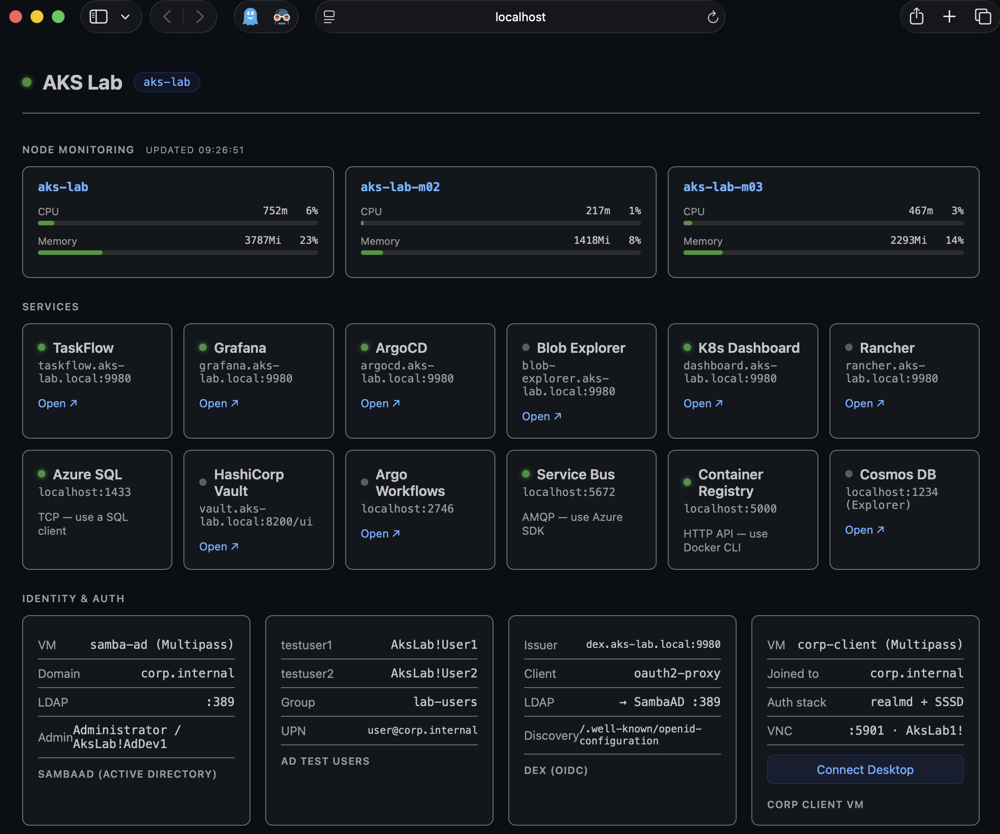

# AKS Homelab

```text
██╗  ██╗██╗   ██╗██████╗ ███████╗██████╗ ███╗   ██╗███████╗████████╗███████╗███████╗
██║ ██╔╝██║   ██║██╔══██╗██╔════╝██╔══██╗████╗  ██║██╔════╝╚══██╔══╝██╔════╝██╔════╝
█████╔╝ ██║   ██║██████╔╝█████╗  ██████╔╝██╔██╗ ██║█████╗     ██║   █████╗  ███████╗
██╔═██╗ ██║   ██║██╔══██╗██╔══╝  ██╔══██╗██║╚██╗██║██╔══╝     ██║   ██╔══╝  ╚════██║
██║  ██╗╚██████╔╝██████╔╝███████╗██║  ██║██║ ╚████║███████╗   ██║   ███████╗███████║
╚═╝  ╚═╝ ╚═════╝ ╚═════╝ ╚══════╝╚═╝  ╚═╝╚═╝  ╚═══╝╚══════╝   ╚═╝   ╚══════╝╚══════╝
                          H O M E L A B
```

**A fully-featured Azure-equivalent Kubernetes lab that runs on your Mac.**  
Simulate AKS, Active Directory, GitOps, secrets management, and Azure PaaS services — locally, from a single script.


---

## What is this?

This lab spins up a production-shaped Kubernetes environment on your Mac in one command. It maps Azure's managed services to local equivalents so you can develop, test, and learn without touching a cloud account or paying a bill.

Everything runs inside a **3-node Minikube cluster** (Docker driver) with real GitOps, real secrets management, real DNS, and real Azure-compatible API surfaces. Pick the components you need — from a minimal cluster to the full identity stack with Active Directory SSO.

---

## Architecture

```text
 ┌─────────────────────────────────────────────────────────────────────────┐
 │  macOS Host                                                              │
 │                                                                          │
 │   ┌─────────────┐   ┌──────────────────┐   ┌──────────────────────┐   │
 │   │  Dashboard  │   │  Vault Dev Server │   │   GitHub (Flux src)  │   │
 │   │  :9997      │   │  :8200  (process) │   │   markpadam/homelab  │   │
 │   └──────┬──────┘   └────────┬─────────┘   └──────────┬───────────┘   │
 │          │                   │                          │ sync 1m       │
 │ ┌────────┴──────────────────┬┴──────────────────────── ┴─────────────┐ │
 │ │  Minikube Cluster  ·  3 nodes  ·  Docker driver                    │ │
 │ │                                                                      │ │
 │ │  ┌─────────────────────────────────────────────────────────────┐   │ │
 │ │  │  Infrastructure                                               │   │ │
 │ │  │  NGINX Ingress :9980  ·  CoreDNS + stub zones  ·  bind9     │   │ │
 │ │  │  Flux (GitOps)  ·  ArgoCD  ·  Prometheus + Grafana          │   │ │
 │ │  │  Kubernetes Dashboard  ·  HashiCorp Vault                   │   │ │
 │ │  └─────────────────────────────────────────────────────────────┘   │ │
 │ │                                                                      │ │
 │ │  ┌──────────────────────┐   ┌──────────────────────────────────┐   │ │
 │ │  │  Applications        │   │  Azure Service Emulators          │   │ │
 │ │  │  TaskFlow            │   │  Azurite  ·  Azure SQL            │   │ │
 │ │  │  Nginx→Node.js→PG   │   │  Service Bus  ·  Cosmos DB        │   │ │
 │ │  │  Blob Explorer       │   │  Container Registry  ·  Vault     │   │ │
 │ │  │  (.NET + Helm)       │   │                                    │   │ │
 │ │  └──────────────────────┘   └──────────────────────────────────┘   │ │
 │ └──────────────────────────────────────────────────────────────────────┘ │
 │                                                                          │
 │   ┌──────────────────────────────────────────────────────────┐         │
 │   │  Multipass VMs  (identity stack — optional)               │         │
 │   │  SambaAD  ·  corp.internal  ·  LDAP/Kerberos/DNS         │         │
 │   │  Corp Client VM  ·  domain-joined Ubuntu + VNC            │         │
 │   └──────────────────────────────────────────────────────────┘         │
 └─────────────────────────────────────────────────────────────────────────┘
```

---

## Components

Components are individually toggleable at setup time or live from the dashboard.

### Infrastructure

| Component | Azure Equivalent | Default |
|-----------|-----------------|:-------:|
| 3-node Minikube (Docker) | AKS node pool | ✅ |
| NGINX Ingress Controller | AKS managed ingress | ✅ |
| CSI hostpath StorageClass | managed-csi | ✅ |
| bind9 + CoreDNS stub zones | ADDS DNS via Cato SDN | ✅ |
| Flux (GitOps) | Azure GitOps (Flux extension) | ✅ |
| ArgoCD | Azure DevOps / Argo | ✅ |
| Prometheus + Grafana | Azure Monitor + Managed Grafana | ✅ |
| Kubernetes Dashboard | AKS resource view | ✅ |
| HashiCorp Vault (KV v2 + K8s auth) | Azure Key Vault + Workload Identity | ✅ |
| Toolbox SSH Pod | Cloud Shell / jump box | ✅ |

### Azure Service Emulators

| Component | Azure Equivalent | Port | Default |
|-----------|-----------------|------|:-------:|
| Azurite | Azure Blob / Queue / Table Storage | 10000–10002 | ✅ |
| Azure SQL Edge | Azure SQL Database | 1433 | ✅ |
| Microsoft Service Bus Emulator | Azure Service Bus | 5672 | ✅ |
| Docker Registry v2 | Azure Container Registry | 5000 | ✅ |
| Microsoft Cosmos DB Emulator | Azure Cosmos DB (NoSQL) | 8081 | ☐ |

### Applications

| Component | Description | Default |
|-----------|-------------|:-------:|
| TaskFlow | Three-tier demo app — Nginx → Node.js → PostgreSQL with HPA | ✅ |
| Blob Explorer | ASP.NET Core app using Azure.Storage.Blobs SDK against Azurite | ✅ |
| Argo Workflows | Kubernetes-native workflow engine | ☐ |
| Azure DevOps Agent | Self-hosted Pipelines agent — run real ADO YAML pipelines in the cluster | ☐ |

### Identity Stack

| Component | Azure Equivalent | Default |
|-----------|-----------------|:-------:|
| Dex (OIDC) | Azure AD — OIDC issuer | ✅ |
| OAuth2 Proxy | Azure AD app registration + SSO gate | ✅ |
| SambaAD *(optional — requires Multipass)* | Azure Active Directory / AD DS | ☐ |
| Corp Client VM *(optional — requires Multipass + Packer cache recommended)* | Domain-joined workstation (XFCE + VNC) | ☐ |

Dex + OAuth2 Proxy ship enabled by default with a **static admin user** (`admin@corp.internal` / `AksLabAdmin1!`) so SSO works without SambaAD. Enable `samba-ad` to add LDAP authentication on top — the LDAP connector activates automatically when the VM is reachable.

---

## Quick Start

> **Docker Desktop memory** — the 3-node cluster needs at least **12 GB** (Low) · **14 GB** (Standard, default) · **18 GB** (High) · **24 GB** (Very High — 32 GB Mac).  
> Set it in Docker Desktop → Settings → Resources → Memory before running. The script warns you if there isn't enough.

```bash
# Install dependencies (first time only)
brew install minikube kubectl helm fluxcd/tap/flux \
             hashicorp/tap/vault terraform multipass packer

# Clone and run (--recurse-submodules also fetches the ADO bicep/pipelines repo)
git clone --recurse-submodules https://github.com/markpadam/Kubernetes-Homelab.git
cd Kubernetes-Homelab
./aks-lab setup
```

> **Already cloned?** Run `git submodule update --init --recursive` to populate `ado/`.  
> Cloning the submodule requires your ADO credentials (username + PAT). See the [Azure DevOps YAML Pipelines](#azure-devops-yaml-pipelines) section for PAT setup.

The setup script prompts for a component preset, then builds everything. The **dashboard opens automatically** at `http://localhost:9997` when done.

Watch the setup flow: [installer.mov](https://github.com/markpadam/Kubernetes-Homelab/releases/download/v1.0.0/installer.mov)

<video src="https://github.com/markpadam/Kubernetes-Homelab/releases/download/v1.0.0/installer.mov" controls title="AKS Homelab setup walkthrough"></video>

| Preset | What you get | Time |
|--------|-------------|------|
| Standard | Cluster + monitoring + GitOps + SSO + storage emulators + demo app | ~15 min |
| Minimal | Bare cluster + ingress only | ~5 min |
| All | Everything including SambaAD LDAP, Cosmos DB, Argo Workflows, Rancher | ~30 min* |
| Custom | Pick individual components | varies |

> **\* Speed up identity VM provisioning** — `samba-ad` and `corp-client` build their VMs from scratch on first run (~5 and ~20 min respectively). Pre-build Packer base images to cut that to under a minute.
>
> ```bash
> IaC/packer/build.sh   # one-time, ~30 min — images cached to ~/.lab-cache/images/
> ```

After setup, run `./aks-lab verify` to confirm every component and ingress is actually responding. The script exits 0 on success or prints a punch list of what's broken.

### Lifecycle

```bash
./aks-lab                # interactive TUI menu (default if you forget the command)
./aks-lab setup          # build and start the lab
./aks-lab verify         # post-setup health check (exits non-zero if anything is broken)
./aks-lab pause          # minikube stop -p aks-lab (keeps all state)
./aks-lab resume         # resume after pause or Mac restart
./aks-lab resize         # shrink node memory after the cluster settles
./aks-lab teardown       # full wipe — cluster, VMs, state, hosts
./aks-lab feature list   # show enabled / available components
./aks-lab help           # full command reference
```

See [QUICKSTART.md](QUICKSTART.md) for the full reference including all flags, component IDs, URLs, and troubleshooting.

---

## Dashboard

A browser dashboard is auto-generated at **`http://localhost:9997`** on every setup and resume. It shows live service links, credentials, quick-copy commands, and a component toggle panel to enable/disable lab features on the fly.



---

## GitOps

Anything committed to `flux/apps/base/` or `flux/infrastructure/base/` is automatically deployed by **Flux** within 1 minute of a push — and restored on every `./aks-lab setup` run. Use this for apps you want to survive teardown.

**ArgoCD** is also installed for visual, point-and-click GitOps — good for experimenting. Apps deployed via the ArgoCD UI are ephemeral (wiped on teardown).

```bash
# Deploy an app via GitOps
cp my-app.yaml flux/apps/base/my-app.yaml
git add . && git commit -m "add my-app" && git push
# Flux reconciles within 60 seconds

flux get all -n flux-system                        # check sync status
flux reconcile kustomization flux-apps -n flux-system  # force sync
```

### Environment overlays (`dev` / `prd`)

Flux watches `flux/clusters/<env>/` where `<env>` is `dev` (default) or `prd`. Switch with the `LAB_ENV` env var:

```bash
./aks-lab setup           # uses flux/clusters/dev — the default
LAB_ENV=prd ./aks-lab setup   # uses flux/clusters/prd instead
```

`prd` starts as a copy of `dev`. Edit `flux/apps/prd/` and `flux/infrastructure/prd/` when you want production to drop dev-only emulators or pin different image digests. `flux/apps/base/` and `flux/infrastructure/base/` remain shared between both overlays.

---

## DNS Lab

The DNS lab simulates the production path where `corp.internal` and `privatelink.*` domains are forwarded to an internal DNS server (ADDS via Cato SDN in production — bind9 here).

```text
Pod query  →  CoreDNS  →  bind9 (corp.internal / privatelink.*)  →  ClusterIP
Pod query  →  CoreDNS  →  upstream                                →  public DNS
```

| Zone | Simulates |
|------|-----------|
| `corp.internal` | AD-authoritative internal zone |
| `privatelink.database.windows.net` | Azure SQL private endpoint |
| `privatelink.blob.core.windows.net` | Storage private endpoint |
| `privatelink.vaultcore.azure.net` | Key Vault private endpoint |
| `privatelink.servicebus.windows.net` | Service Bus private endpoint |
| `privatelink.azurecr.io` | Container Registry private endpoint |

```bash
# Edit zones and records
vim flux/infrastructure/base/dns/dns-config.yaml
./IaC/dns/apply-dns-config.sh
```

---

## Azure Mapping

| Azure | Lab |
|-------|-----|
| AKS | Minikube 3-node (Docker driver) |
| AKS resource view (portal) | Kubernetes Dashboard v7 |
| Azure Key Vault | HashiCorp Vault — KV v2 + Kubernetes auth |
| AKS Workload Identity | Vault Kubernetes auth backend |
| Azure Monitor + Managed Grafana | Prometheus + Grafana (kube-prometheus-stack) |
| Azure Blob / Queue / Table | Azurite |
| Azure SQL Database | Azure SQL Edge |
| Azure Service Bus | Microsoft Service Bus Emulator |
| Azure Container Registry | Docker Registry v2 |
| Azure Cosmos DB | Microsoft Cosmos DB Emulator (NoSQL API) |
| Azure Active Directory | Samba 4 AD DC (`corp.internal`) |
| OIDC / Azure AD app | Dex OIDC provider |
| SSO / Conditional Access | OAuth2 Proxy |
| ADDS DNS via Cato SDN | bind9 + CoreDNS stub zones |
| Azure Private DNS Zones | bind9 privatelink zones |
| GitOps (persistent) | Flux |
| GitOps (ephemeral/visual) | ArgoCD |
| managed-csi StorageClass | CSI hostpath driver |
| Azure DevOps self-hosted agent on AKS | Azure Pipelines agent pod in Minikube |

---

## Azure DevOps YAML Pipelines

The `azdo-agent` component runs a self-hosted Azure Pipelines agent as a pod in the cluster — the same pattern used in production on AKS. This lets you write and run real ADO YAML pipelines against the lab's Kubernetes, Vault, and Azure emulator services.

### Prerequisites

1. Free Azure DevOps org at [dev.azure.com](https://dev.azure.com) (sign in with any Microsoft account — no payment needed)
2. Create an agent pool: **Organisation Settings → Agent pools → Add pool → Self-hosted**
3. Create a PAT: **User Settings → Personal Access Tokens → New token** — scope: **Agent Pools (Read & Manage)**

### Enable the agent

```bash
./aks-lab feature enable azdo-agent
```

On the **first run** `./aks-lab setup` will prompt for org URL, pool name, and PAT. Credentials are saved to `~/.lab-ado` (mode `600`, never committed) and reused on every subsequent run.

To update credentials:

```bash
./aks-lab setup --reconfigure-ado
```

The agent registers automatically when the pod starts and appears in your ADO pool within ~30 seconds.

### Use in a pipeline

```yaml
# azure-pipelines.yml
trigger:
  - main

pool:
  name: Kubernetes-Homelab   # your agent pool name

steps:
  - script: kubectl get pods -A
    displayName: List cluster pods

  - script: |
      vault kv get kv/azure-services/placeholder
    displayName: Read a Vault secret
    env:
      VAULT_ADDR: http://vault.aks-lab.local:8200
      VAULT_TOKEN: root
```

The agent pod has network access to all in-cluster services — Vault, Azurite, Azure SQL, Service Bus, etc. — so pipelines can deploy to and test against the full lab stack.

---

## Repo Structure

```text
├── aks-lab               # Main entry script — interactive TUI or subcommand mode
├── lab-components.json   # Component registry
├── dashboard-server.py   # Local dashboard server
├── dashboard-template.html
│
├── scripts/              # Implementation scripts (called by ./aks-lab)
│   ├── setup-lab.sh      # Build and start the lab
│   ├── resume-lab.sh     # Resume after pause / restart
│   ├── teardown-lab.sh   # Full wipe
│   ├── verify-lab.sh     # Post-setup health check
│   ├── refresh-lab.sh    # Re-apply manifests on running cluster
│   ├── lab-resize.sh     # Live-shrink node memory (workers → 2 GB, master −22%)
│   ├── lab-feature.sh    # Component manager (enable/disable/list)
│   ├── menu.py           # TUI action menu (no-args entry point)
│   ├── tui.py            # Setup-flow live dashboard
│   └── lib-common.sh     # Shared bash helpers
│
├── src/                  # Application source + Dockerfiles
│   ├── taskflow/         # Node.js API
│   ├── blob-explorer/    # ASP.NET Core
│   └── toolbox/          # Ubuntu SSH pod
│
├── flux/               # Flux/GitOps-managed manifests
│   ├── apps/
│   │   ├── base/         # Flux-managed application manifests
│   │   ├── dev/          # Dev overlay (default for LAB_ENV=dev)
│   │   └── prd/          # Prd overlay (starts as a copy of dev)
│   ├── infrastructure/
│   │   ├── base/         # Flux-managed infrastructure manifests
│   │   ├── dev/          # Dev infra overlay
│   │   └── prd/          # Prd infra overlay
│   └── clusters/
│       ├── dev/          # Flux entry point for dev
│       └── prd/          # Flux entry point for prd
├── helm/                 # Helm charts
│
├── IaC/
│   ├── terraform/        # Vault + SambaAD + Corp Client VMs
│   ├── packer/           # Packer templates — pre-built base images for Multipass VMs
│   └── dns/              # DNS management scripts
│
└── ado/                  # Git submodule → Azure DevOps (Bicep IaC + YAML pipelines)
```

---

## Repository Layout

This project spans two repos linked by a git submodule.

| Repo | Host | Contains | Why here |
|------|------|----------|----------|
| `Kubernetes-Homelab` (this repo) | GitHub | K8s manifests, Flux config, Helm charts, lab scripts, app source | Flux requires a public git source for reconciliation |
| `ado/` (submodule) | Azure DevOps | Bicep templates, YAML pipeline definitions | ADO pipeline triggers, service connections, and RBAC are native to ADO |

**Flux** watches this GitHub repo from `flux/clusters/<env>/`, then reconciles the matching `flux/apps/<env>/` and `flux/infrastructure/<env>/` overlays automatically. **ADO pipelines** in `ado/` deploy real Azure infrastructure via Bicep and can target the lab cluster via the self-hosted agent.

### Working with the submodule

```bash
# Pull latest changes from both repos
git pull --recurse-submodules

# Update the submodule to the latest ADO commit and record it here
git submodule update --remote ado
git add ado && git commit -m "chore: bump ado submodule"

# Make changes inside the ADO repo
cd ado
git checkout main
# edit bicep / pipeline files, then commit and push to ADO
git add . && git commit -m "feat: ..." && git push
cd ..
# record the new submodule pointer in the GitHub repo
git add ado && git commit -m "chore: bump ado submodule"
```

---

## Documentation

| Doc | Description |
|-----|-------------|
| [QUICKSTART.md](QUICKSTART.md) | Start, pause, resume, destroy — flags, URLs, troubleshooting |
| [ARCHITECTURE.md](ARCHITECTURE.md) | Detailed diagrams — cluster layout, GitOps flow, secrets, DNS |
| [docs/README.md](docs/README.md) | Full service documentation index |
| [docs/iac/packer.md](docs/iac/packer.md) | Packer VM image builder — pre-bake samba-ad and corp-client base images |

---

## Security note

This lab is **local-only** and intended for learning. It ships with weak, well-known defaults:

- `admin / admin123` for Grafana
- `admin / AksLabAdmin1!` for SSO (Dex static user)
- `admin / AksLabRancher1` for Rancher
- `sa / AksLab!SqlDev1` for Azure SQL
- `Administrator / AksLab!AdDev1` for SambaAD
- Vault dev mode with `root` token (data is in-memory)

Internal-only secrets (OAuth2 cookie key, Dex client secret) are generated randomly on first setup and persisted to `~/.aks-lab-secrets` (`chmod 600`) so they survive across resume cycles. Nothing here should ever be exposed to a network. Do not adapt these manifests for shared environments without replacing every credential.

---

*Built for learning Azure-shaped infrastructure patterns without the Azure bill.*

---

## Forking

If you fork this repo, update `GITHUB_REPO` near the top of `scripts/setup-lab.sh` (and the equivalent line in `scripts/resume-lab.sh`) to point at your fork — Flux uses that URL to sync manifests.

Questions or issues: [markpadam@hotmail.com](mailto:markpadam@hotmail.com)
